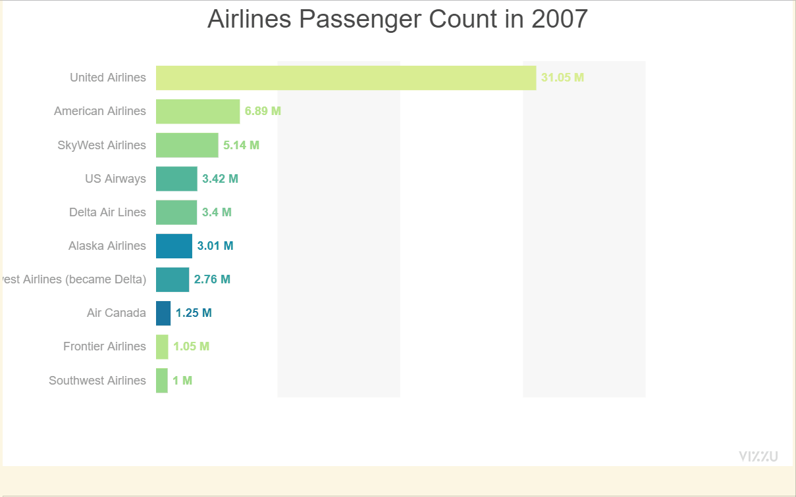

### How to get Top N rows of each group using Pandas and DuckDB

In this repo we will look into the different methods to get Top N rows of each group. We all must have faced a scenario of getting top N result set based on some criteria but here we will look into another scenario of identifying the Top N rows of every group.

### Dataset

We will be using San Francisco Airport Air Traffic Passenger Statistics from 2005 to 2022. Original Dataset can be accessed from [here](https://medium.com/r?url=https%3A%2F%2Fdata.sfgov.org%2FTransportation%2FAir-Traffic-Passenger-Statistics%2Frkru-6vcg).

### Demo App

### Deepnote link

Published Notebook: https://deepnote.com/@pythonsnippets/Codepractice-76e2df7a-4a6e-4112-9680-1feec18bdf23

Notebook Link: https://deepnote.com/workspace/pythonsnippets-5cbb3986-f851-42c9-8439-c843feee6bef/project/Codepractice-76e2df7a-4a6e-4112-9680-1feec18bdf23/notebook/Top_N_rows-327cf622527040b48fc2d6f4d2f17bc4

